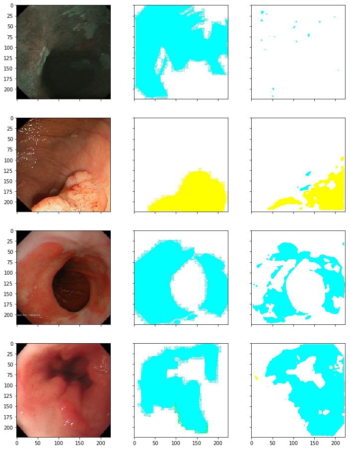

# EDD2020  
### Description.
Endoscopy is a widely used clinical procedure for the early etection of cancers in hollow-organs such as oesophagus, stomach, colon and bladder. Computer-assisted methods for accurate identification of tissues that are malignant, or potentially malignant has been at forefront of healthcare research to improve clinical diagnosis. Many methods to detect diseased regions in endoscopy have been proposed, however, these have primarily focussed on the task of polyp -- deleterious intestinal protrusion in the gastrointestinal tract -- detection on datasets that lack richness.  
The EDD2020 proposes a rich consolidated dataset from various leading research institues on cancer, under the supervision of cancer experts in collaboration with University of Oxford. This dataset not only focusses on just polyp detection but also on several other malignant tissues, leading to multi-class disease detection and segmentation challenge in clinical endoscopy. This challenge aims to establish a comprehensive dataset to benchmark algorithms for disease detection in endoscopy.  
Please refer [this](https://edd2020.grand-challenge.org/)  for details.  

### Approach
This is a semantic segmentation task where an image can belong to either of the 5 labels: BE, suspicious, HGD, polyp, cancer.

The data preparation stage involves resizing erratic & irregular sized images to 224 x 224 size using [this script](https://evigio.com/post/resizing-images-into-squares-with-opencv-and-python).  
In addition, data preparation includes augmentation approaches like flipping images, or morphing image; utilities in the Albumenations library are leveraged to achieve augmentation to increase the data size since the original data size is only 386, which is inadequate to train any neural network.  

The current approach towards addressing the problem involves utilizing unet+resnet to identify segmentations(affected regions), and hence bounding-boxes(co-ordinates) thereafter.  

Training involved 2 phases: the first utilised 128 x 128 sized images and trained for 20 epochs, and thereafter the weights were saved; the second phase involved training the model on 224 x 224 sized images with weights from the first stage that were stored.  
This approach currenly gives a score 0.1312, the more the better. The following are the results obtained where the first column contains original images, the second contains true annotation, and the third contains predictions.  
The color signifies the correctness of annotation-- among BE,suspicious,HGD,polyp,cancer.

Further improvements include using self-supervised learning to improve training.
